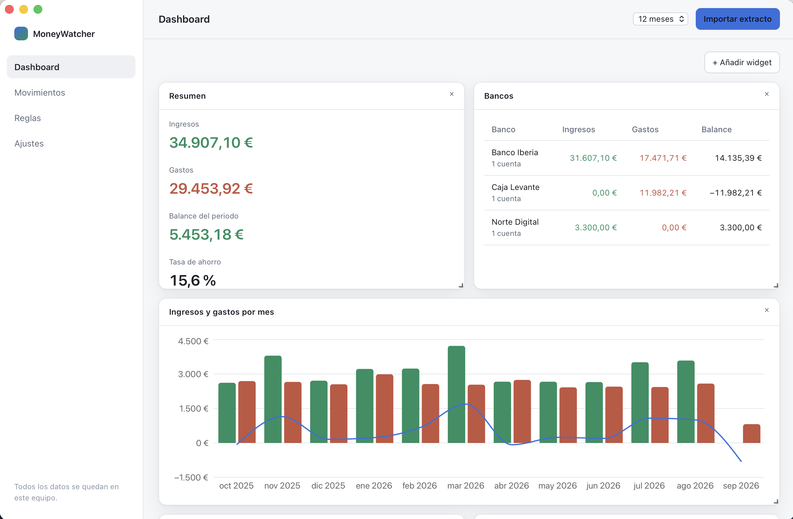
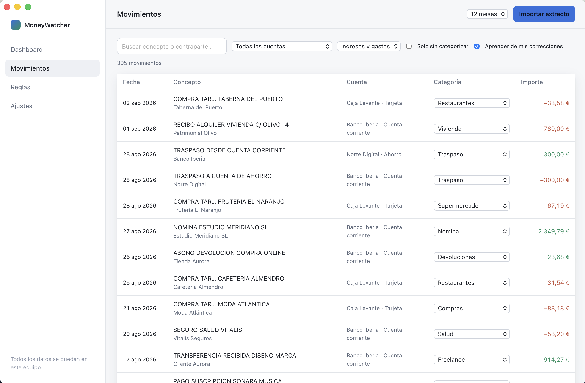
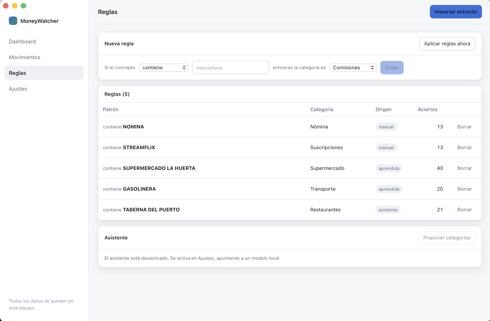
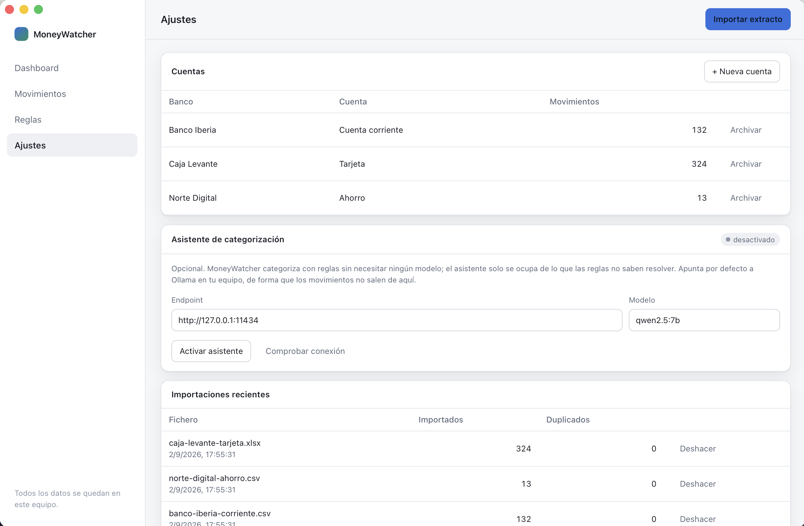
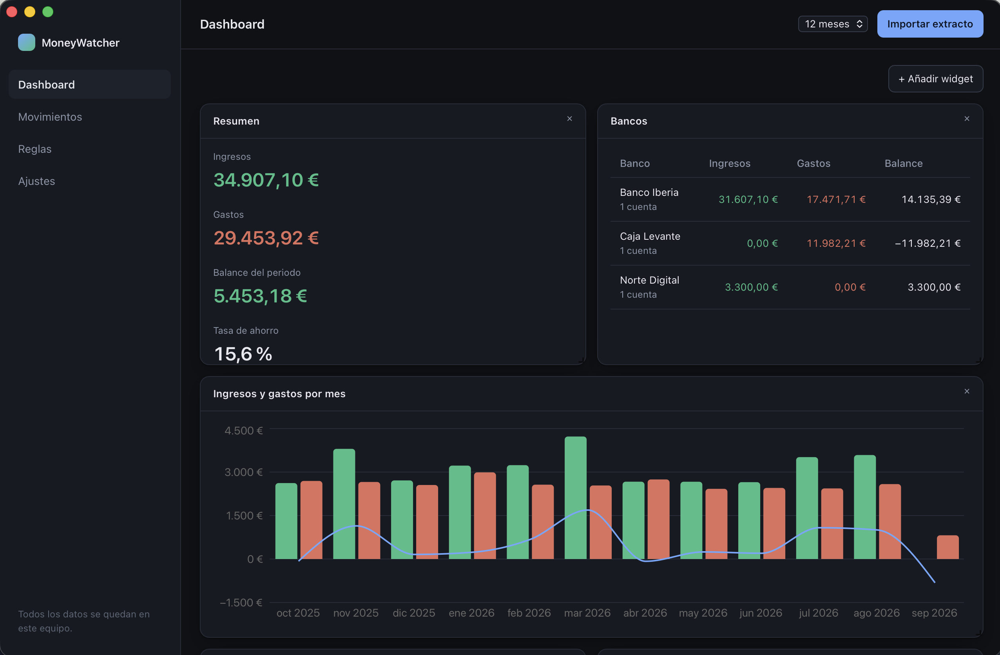

# MoneyWatcher

A local-first desktop dashboard for personal finances: drop in your bank statements, let the app
sort them out, and read your money as charts and tables instead of spreadsheet rows.

Your transactions never leave your machine. There is no account, no sync, no telemetry and no
server — the whole app is a single binary and a SQLite file in your user directory.

---

## What it looks like



| Movements | Rules |
| --- | --- |
| [](docs/screenshots/transactions.png) | [](docs/screenshots/rules.png) |
| Filter, search and fix a category inline — the fix teaches a rule. | Rules you wrote, rules learnt from your corrections, rules accepted from the assistant. |

| Settings | Dark theme |
| --- | --- |
| [](docs/screenshots/settings.png) | [](docs/screenshots/dashboard-dark.png) |
| Accounts, the optional local assistant, and every import with an undo. | The app follows the system theme. |

Every figure above comes from a synthetic dataset — invented banks, invented shops — built by
`cargo run -p moneywatcher-core --example seed_demo`. No real statement is involved, here or
anywhere else in this repository.

## What it solves

Most people keep their finances in a spreadsheet: one sheet per bank, incomes on one side,
expenses on the other, and a monthly ritual of copying rows out of the bank's CSV export and
tagging them by hand. It works, and it is tedious enough that it eventually stops happening.

MoneyWatcher keeps that mental model — money organised **by bank**, split into **income** and
**expense** — and removes the manual part:

- You import the file your bank gives you — a CSV or the Excel workbook some banks offer instead.
  The app figures out the delimiter or the right sheet, the encoding, which row is the header,
  which columns hold the date, the description and the amount, and whether the file uses
  `1.234,56` or `1,234.56`.
- Every movement gets categorised by rules that the app learns from your own corrections. Fix
  "MERCADONA" once and every past and future Mercadona lands in Groceries by itself.
- The dashboard is a grid of widgets you arrange yourself: monthly income vs expense, breakdown by
  category, income and expense per bank, where your money actually goes. Add, resize, drag, remove.

An optional assistant (a local model served by Ollama) can propose categories for the leftovers
that no rule matched. It is off by default, it only ever proposes, and nothing is applied without
your confirmation.

## What makes it interesting

- **Money is never a float.** Every amount is an `i64` of minor units inside a `Money` type, and it
  crosses the Rust ↔ TypeScript boundary as a decimal string. No accumulated rounding error in the
  monthly totals, no `0.30000000000000004` in a total.

- **Movements, not balances.** The app records what moved and when. It never asks you for an
  opening balance and never claims to know how much money sits in your account — a number it could
  only keep right if you imported every statement, in order, forever. What each statement says the
  balance was is still read, but only to check the file was understood: if the jump between two
  consecutive balances does not match the amount between them, the import is wrong and you are
  told.
- **Transfers between your own accounts stop counting twice.** Moving 300 € from your current
  account to your savings is not a 300 € expense plus a 300 € income, but that is what two
  statements say. The app pairs the two sides — same amount, opposite signs, different accounts, at
  most two days apart — and leaves them out of the totals. Tested against a real year of
  statements from five banks, transfers turned out to be more than a third of both columns. It is
  off until you switch it on, every pair is listed for review, and one click puts a wrong one back
  where it was.
- **Statement parsing that survives real banks.** Preambles before the header, cover sheets before
  the movements, Windows-1252 encoding, semicolon delimiters, split debit/credit columns, fees
  charged in a column of their own, amounts padded to nine decimal places, ambiguous `03/04/2026`
  dates resolved once per file instead of row by row, and unreadable rows reported with a reason
  instead of silently dropped.
- **Deterministic first, AI second.** The categorisation engine is a plain, ordered rule evaluator
  that runs offline in microseconds. The LLM is a bolt-on for the residue, isolated behind an
  adapter, and the app is fully functional with the network cable pulled out.
- **Idempotent imports.** Each movement carries a SHA-256 fingerprint of account, date, amount and
  normalised description, so re-importing an overlapping statement adds the new rows and skips the
  ones you already have.

## How it works

```text
  statement ──▶ importer ──▶ preview  ──▶ transactions (SQLite)
                                │              │
                                │              ├──▶ rule engine ──▶ categories
                                │              │         ▲
                                │              │         └── learned from your corrections
                                │              │
                                │              └──▶ analytics ──▶ dashboard widgets
                                │
                                └── nothing is stored until you confirm the preview
```

The Rust core owns every financial decision — parsing, deduplication, rule evaluation, aggregation
and persistence. The React frontend renders what the core returns and never computes money on its
own.

## Architecture

```text
MoneyWatcher/
├── core/                      # moneywatcher-core: the engine, free of any UI dependency
│   ├── migrations/            # versioned SQL schema (0001_initial.sql, …)
│   ├── src/
│   │   ├── domain/            # Money, Account, Transaction, Category, Rule + typed ids
│   │   ├── storage/           # SQLite connection, migrations and repositories
│   │   ├── importer/          # CSV and spreadsheet readers + header, column and date detection
│   │   ├── rules/             # rule engine and rule learning
│   │   ├── transfers/         # pairing of transfers between the user's own accounts
│   │   ├── analytics/         # aggregations that feed the widgets
│   │   └── ai/                # optional assistant (Ollama adapter, prompt, answer parsing)
│   └── tests/                 # integration tests over synthetic statements
├── src-tauri/                 # desktop shell: Tauri commands, state, error mapping
│   └── src/commands/          # one module per area, thin wrappers over the core
├── src/                       # React + TypeScript frontend
│   ├── widgets/               # one component per widget kind + the catalog
│   ├── views/                 # dashboard, transactions, rules, settings
│   ├── components/            # import and account dialogs
│   ├── lib/ipc.ts             # the only place that calls `invoke`
│   └── types/ipc.ts           # the DTO contract mirrored from Rust
└── docs/
    ├── architecture.md
    └── decisions/             # numbered ADRs
```

## Requirements

- **Rust** 1.77 or newer (`rustup` recommended)
- **Node.js** 20 or newer
- **Tauri prerequisites** for your platform (Xcode Command Line Tools on macOS; WebKitGTK and
  `libayatana-appindicator` on Linux; WebView2 on Windows) — see
  [tauri.app/start/prerequisites](https://tauri.app/start/prerequisites/)

SQLite is bundled and compiled from source; you do not need it installed.

## Install and run

```bash
git clone https://github.com/juanmmm21/MoneyWatcher.git
cd MoneyWatcher
npm install

npm run tauri dev      # development window with hot reload
npm run tauri build    # distributable bundle for your platform
```

The database is created on first launch at your platform's application data directory:

| Platform | Path |
| --- | --- |
| macOS | `~/Library/Application Support/com.juanmmm21.moneywatcher/moneywatcher.db` |
| Linux | `~/.local/share/com.juanmmm21.moneywatcher/moneywatcher.db` |
| Windows | `%APPDATA%\com.juanmmm21.moneywatcher\moneywatcher.db` |

Settings → *Your data* shows the exact path in the app. Back it up by copying that file.

## Using it

1. **Create an account per bank** in Settings (bank name, account name, kind).
2. **Import a statement**: *Import statement* → pick the account → choose the file. The app shows
   what it understood — the delimiter or sheet it read, the detected columns, the parsed rows and
   any line it could not read — and only writes to the database when you confirm.
3. **Categorise**: rules run automatically after every import. Whatever is left shows up in the
   dashboard as *movimientos sin categorizar*; fix one in the Movimientos table and, with
   *aprender de mis correcciones* enabled, the app writes the rule and applies it to the rest of
   your history.
4. **Turn on transfer detection** (optional) in Settings → *Traspasos entre cuentas*, once you
   have imported more than one account. It pairs the two sides of every transfer between your own
   accounts and keeps them out of the widgets, so the totals stop counting the same money twice.
   The pairs are listed there for review and any of them can be put back with one click.
5. **Build your dashboard**: *+ Añadir widget*, then drag by the widget header and resize from the
   corner. The layout is stored in the database and comes back the next time you open the app.

### Supported statement formats

CSV and tab-separated exports, plus the Excel workbooks (`.xlsx`, `.xls`) and OpenDocument sheets
(`.ods`) that several banks offer instead. The format is decided by the file's content, not its
extension. The importer detects:

| Aspect | Handled |
| --- | --- |
| File type | CSV / TSV, `.xlsx`, `.xls`, `.ods` |
| Delimiter | `;` `,` tab `\|` |
| Encoding | UTF-8 (with or without BOM) and Windows-1252 |
| Sheet | the one that looks like a movement table, so cover and summary sheets are skipped |
| Header | any row within the first 500, so bank preambles are skipped |
| Date columns | booking date and value date, `dd/mm/yyyy`, `mm/dd/yyyy`, `yyyy-mm-dd`, 2-digit years, written months (`12 feb 2026`), and real spreadsheet dates |
| Amount columns | one signed column, or separate debit/credit columns |
| Amount formats | `1.234,56`, `1,234.56`, `(45,00)`, `12,00-`, `1.234,56 €`, `EUR 12,00`, `12.710000000` |
| Fees | a fee column charged on top of the amount is subtracted, but only when the statement's own balance confirms it |
| Extra columns | counterparty and the running balance the statement reports |

Column names are matched in Spanish and English (`Fecha operación`, `Concepto`, `Importe`, `Cargo`,
`Abono`, `Saldo`, `Disponible`, `Comisión`, `Date`, `Description`, `Debit`, `Credit`, `Balance`, …).

Whatever the format, the amounts are checked against the balance the statement itself reports:
between two consecutive rows, the jump in balance has to be exactly the amount in between. It is
the cheapest way to know a new bank's format was read correctly, down to the cent.

### The optional assistant

Settings → *Asistente de categorización*. Point it at a local [Ollama](https://ollama.com) instance
(`http://127.0.0.1:11434` by default) and pick a model you have pulled. Model size matters more
than anything else here: below 4B the answers are not usable, and the example below measures any
model you have against a fixed set of Spanish bank descriptions before you trust it. The app sends only the
description, counterparty and amount of the movements no rule could classify — never account names,
balances or identifiers — and shows the model's proposals for you to accept one by one. If you
point it at a non-local endpoint, the UI warns you explicitly that data would leave your machine.

## Using the core as a library

The engine is a plain Rust crate with no Tauri dependency, so it can be used from a CLI, a script or
your own tooling:

```rust
use moneywatcher_core::domain::AccountId;
use moneywatcher_core::importer::parse_statement;

let bytes = std::fs::read("statement.xlsx")?;
let preview = parse_statement(&bytes)?;

println!("{} movements, {} unreadable lines", preview.rows.len(), preview.skipped.len());
println!("period total: {}", preview.total_amount().to_decimal_string());

let transactions: Vec<_> = preview
    .rows
    .iter()
    .map(|row| row.to_new_transaction(AccountId(1), None))
    .collect();
```

```rust
use moneywatcher_core::storage::{Database, TransactionFilter};

let database = Database::open(std::path::Path::new("moneywatcher.db"))?;
let totals = database.flow_totals(&TransactionFilter::default())?;

println!("income {} / expense {}", totals.income, totals.expense);
```

## Development

```bash
# Rust core and desktop shell
cargo test --workspace
cargo clippy --workspace --all-targets -- -D warnings
cargo fmt --all

# Frontend
npm run typecheck
npm run lint
npm test
```

The Rust test suite covers the money type, the SQLite repositories and migrations, the statement
importer (against synthetic statements in `core/tests/fixtures/`), the rule engine and every
dashboard aggregation.

### Measuring a model before trusting it

```bash
ollama serve
cargo run -p moneywatcher-core --example benchmark_assistant -- gemma3 qwen2.5:7b phi4
```

Runs 35 synthetic Spanish bank descriptions through each model in batches of 25 — the same batch
size the app uses — and reports how many it gets right, how many it declines to answer, how many of
its *confident* answers are right, and how long it took. That last-but-one column is the one that
matters: a wrong answer the model is sure about is the one a user accepts without looking.

### Running against a demo database

The app opens the database in your user data directory, which is where your own finances live.
`MONEYWATCHER_DATA_DIR` points it somewhere else, so you can develop — or take screenshots —
against invented data without touching it:

```bash
cargo run -p moneywatcher-core --example seed_demo -- /tmp/moneywatcher-demo
MONEYWATCHER_DATA_DIR=/tmp/moneywatcher-demo npm run tauri dev
```

`seed_demo` builds three accounts at invented banks, fourteen months of movements and a handful of
rules, all from a fixed seed, so the same command always produces the same figures. It refuses to
write over an existing database.

### Regenerating the icon

The app icon is a single SVG in `docs/icon/icon.svg`. `bash docs/icon/generate.sh` rasterises it and
writes every size the bundler needs — PNGs, the macOS `.icns` and the Windows `.ico` — using only
tools that ship with macOS.

## Troubleshooting

**"could not find a header row with a date, a description and an amount"** — the file is probably
not the movement export but a summary or a PDF-turned-CSV. Export the movement list again, and make
sure the header row contains a date column, a description column and either an amount column or a
debit/credit pair.

**Dates came in with day and month swapped** — the importer resolves the order once per file by
looking for a day above 12 anywhere in the date column. A statement where every date is ambiguous
(all days ≤ 12) falls back to day-first. Undo the import from Settings → *Importaciones recientes*
and re-import with a wider date range so the file contains at least one unambiguous date.

**Re-importing added nothing** — that is the deduplication working: the movements were already
there. Only genuinely new rows are inserted.

**The assistant says "sin respuesta"** — Ollama is not running or is listening elsewhere. Start it
with `ollama serve`, confirm the model is pulled (`ollama list`), and press *Comprobar conexión*.

**Accented characters look wrong** — the file is in an encoding other than UTF-8 or Windows-1252.
Re-export as UTF-8, or open and re-save it as UTF-8 before importing.

## License

[MIT](LICENSE) © juanmmm21
